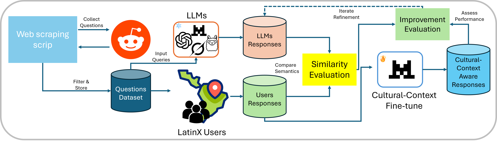

# Advancing Equitable AI: Evaluating Cultural Expressiveness in LLMs for Latin American Contexts

## Overview
This repository contains the code, dataset, and resources for the paper *"Advancing Equitable AI: Evaluating Cultural Expressiveness in LLMs for Latin American Contexts"* by Brigitte A. Mora-Reyes and Jennifer A. Drewyor, presented at the Latinx in AI Workshop at ICML 2025. The project evaluates the cultural expressiveness of large language models (LLMs) in representing Latin American contexts, addressing biases from economically advanced regions that marginalize diverse perspectives. We introduce a culturally aware dataset and a framework to enhance LLMs' cultural context awareness, achieving a 42.9% improvement in cultural expressiveness for the fine-tuned Mistral-7B model.

## Dataset
The dataset consists of 535 unique questions sourced from 13 Latin American-focused subreddits (e.g., r/AskLatinAmerica, r/Mexico, r/Brazil) via web scraping. A curated subset of 54 questions was used to evaluate six LLMs (Mistral-7B, Zephyr-7B, BLOOM-7B, Llama-2-7B, Grok, and ChatGPT) for cultural context awareness. Ground-truth responses were provided by 12 Latin American users, aggregated into two sets (Resp V1 and Resp V2) using Sentence-BERT embeddings and sentiment analysis.

- **Data Location**: `data/questions_latin_america.csv`
- **Response Files**: `data/responses_<model>.csv` (e.g., `responses_grok.csv`, `responses_chatgpt.csv`)
- **Metadata**: Includes question text, source URL, and subreddit name for traceability.

## Framework
Our framework, illustrated below, enhances LLMs' cultural context awareness through fine-tuning with a culturally aware dataset. The framework integrates keyword frequency, sentiment alignment, and semantic similarity to compute a Cultural Expressiveness (CE) metric, as shown in Equation 1 from the paper:

\[
CE = \alpha_1 \cdot \text{Key. Freq.} + \alpha_2 \cdot (1 - \Delta S) + \alpha_3 \cdot \text{Sem. Sim.}
\]

where \(\alpha_1 = 0.3\), \(\alpha_2 = 0.3\), \(\alpha_3 = 0.4\).



*Figure 1: Framework proposed to inject cultural context awareness into LLMs (from the paper).*

## Requirements
To run the code, install the required dependencies:

```bash
pip install -r requirements.txt
```

Key dependencies:
- Python 3.8+
- `transformers` (Hugging Face)
- `sentence-transformers` (for Sentence-BERT embeddings)
- `torch` (for GPU support)
- `pandas`, `numpy` (for data processing)
- `scikit-learn` (for statistical analysis)
- `matplotlib`, `seaborn` (for visualizations)

## Usage
1. **Setup Environment**:
   ```bash
   git clone https://github.com/<your-repo>/equitable-ai-latin-america.git
   cd equitable-ai-latin-america
   pip install -r requirements.txt
   ```

2. **Dataset Preparation**:
   - The dataset is stored in `data/questions_latin_america.csv`.
   - LLM responses are in `data/responses_<model>.csv`.

3. **Fine-Tuning Mistral-7B**:
   - Run the fine-tuning script to enhance Mistral-7B's cultural expressiveness using Low-Rank Adaptation (LoRA):
     ```bash
     python scripts/finetune_mistral.py --data data/questions_latin_america.csv --output_dir models/finetuned_mistral
     ```
   - Requirements: NVIDIA GPU (e.g., RTX 3070, 8GB VRAM), 3 epochs, batch size 1, gradient accumulation over 4 steps.


## Repository Structure
```
equitable-ai-latin-america/
├── data/
│   ├── questions_latin_america.csv        # Curated questions dataset
│   ├── responses_<model>.csv             # LLM responses (e.g., responses_grok.csv)
├── scripts/
│   ├── finetune_mistral.py               # Fine-tuning script for Mistral-7B
│   ├── evaluate_ce.py                    # Script to compute CE scores
│   ├── plot_results.py                   # Script for generating visualizations
├── figures/
│   ├── framework_cultural_context.png     # Framework figure
│   ├── keyword_frequency.png             # Figure 2
│   ├── sentiment_distribution.png         # Figure 3
├── results/
│   ├── ce_scores.csv                     # Cultural Expressiveness scores
│   ├── sentiment_analysis.csv            # Sentiment differences
│   ├── semantic_similarity.csv           # Semantic similarity scores
├── requirements.txt                      # Python dependencies
└── README.md                             # This file
```

## Results
- **Cultural Expressiveness (CE) Scores** (Table 3):
  - Zephyr-7B: 0.62
  - Grok: 0.58
  - Fine-tuned Mistral-7B: 0.70 (42.9% improvement)
- **Key Findings**:
  - Fine-tuning Mistral-7B improved keyword frequency by 36.0%, reduced sentiment misalignment by 57.9%, and increased semantic similarity by up to 19.0%.
  - ChatGPT and Llama-2-7B exhibit positivity biases, oversimplifying complex socio-political issues.
  - Zephyr-7B and Grok align better with Latin American user perspectives.

## Citation
If you use this code or dataset, please cite our paper:

```bibtex
@inproceedings{mora2025advancing,
  title={Advancing Equitable AI: Evaluating Cultural Expressiveness in LLMs for Latin American Contexts},
  author={Mora-Reyes, Brigitte A. and Drewyor, Jennifer A.},
  booktitle={Proceedings of the Latinx in AI Workshop at ICML},
  year={2025},
  address={Vancouver, Canada}
}
```

## License
This project is licensed under the MIT License. See the `LICENSE` file for details.

## Contact
For questions, contact:
- Brigitte A. Mora-Reyes: [brigitte.morar@ug.edu.ec](mailto:brigitte.morar@ug.edu.ec)
- Jennifer A. Drewyor: [jadrewyor@mtu.edu](mailto:jadrewyor@mtu.edu)

## Acknowledgements
We thank the Latin American communities on Reddit for their contributions to the dataset and the Latinx in AI Workshop for providing a platform to share this work.
